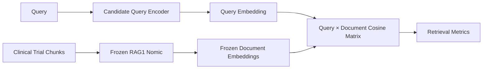

# RAG2 — Query Encoder Experiments

## Objective

RAG2 tested whether a **separate query encoder** could improve retrieval after RAG1 had already specialized the document embedding space.

The hypothesis was:

> A specialized query encoder might learn better query-document alignment with the frozen RAG1 document representation.

---

## Experimental Architecture



Unlike RAG1, the query and document encoders were not necessarily the same model.

---

## Experimental Setup

The final RAG1 fine-tuned Nomic model was frozen as the:

```text
Document Encoder
```

Three query encoders were evaluated independently:

1. **Pretrained Nomic Embed Text v1.5**
2. **PubMedModernBERT**
3. **BGE 768D**

All query embeddings were 768D.

No Matryoshka training was used in RAG2.

---

## Why the Standard IR Evaluator Was Not Used

`InformationRetrievalEvaluator` assumes the same embedding model encodes both queries and documents.

RAG2 instead required:

```text
Frozen document embeddings
+
Candidate query embeddings
+
Custom similarity matrix
```

Therefore a custom evaluator calculated:

- Accuracy@K
- Precision@K
- Recall@K
- MRR@10
- NDCG@10
- MAP@100

---

## Training Strategy

Rows belonging to the same clinical-trial chunk/document were grouped.

Example:

```text
Rows 1, 7, 11, 22 → same document Cᵢ
```

For each batch:

1. Randomly select one anchor from each distinct document group.
2. Encode selected queries using the candidate query encoder.
3. Compare against frozen RAG1 document embeddings.
4. Compute cosine similarity.
5. Apply temperature-scaled logits.
6. Use the correct document position as the target.
7. Optimize cross-entropy loss.

This is analogous to an in-batch-negative contrastive learning setup.

### Important clarification

Randomly selecting different anchors from each document group is:

> **stochastic anchor sampling / diversification**

It is **not dropout**.

---

## Results

### Nomic Query Encoder

| Configuration | NDCG@10 | MRR@10 | R@1 | R@3 | R@5 | R@10 |
|---|---:|---:|---:|---:|---:|---:|
| RAG1 symmetric FT | **0.66290** | 0.63398 | 0.57433 | 0.68234 | 0.71029 | 0.75349 |
| RAG2 Nomic baseline | 0.58907 | 0.55693 | 0.49174 | 0.59848 | 0.64930 | 0.68996 |
| RAG2 Nomic FT | 0.65951 | 0.63204 | 0.57179 | 0.67853 | **0.71919** | 0.74460 |

The separately trained Nomic query encoder nearly recovered the symmetric RAG1 result but did not improve it.

---

### PubMedModernBERT Query Encoder

| Configuration | NDCG@10 | R@1 | R@3 | R@5 | R@10 |
|---|---:|---:|---:|---:|---:|
| Baseline | 0.001762 | 0.00127 | 0.00127 | 0.00254 | 0.00254 |
| Fine-tuned | 0.183488 | 0.07370 | 0.14867 | 0.21474 | 0.33926 |

Fine-tuning improved alignment substantially, but retrieval remained far below the Nomic-based configuration.

---

### BGE Query Encoder

| Configuration | NDCG@10 | R@1 | R@3 | R@5 | R@10 |
|---|---:|---:|---:|---:|---:|
| Baseline | 0.001733 | 0 | 0 | 0.00254 | 0.00508 |
| Fine-tuned | 0.233301 | 0.11690 | 0.20839 | 0.28081 | 0.38628 |

Again, fine-tuning improved alignment but did not reach the symmetric Nomic architecture.

---

## What Happened?

The major issue was **embedding-space mismatch**.

```text
Query Encoder Space
        ↓
     cosine
        ↓
Frozen Nomic Document Space
```

Different pretrained embedding models do not automatically produce compatible vector spaces.

Fine-tuning helped the query encoders adapt toward the frozen document space, but:

```text
FT Nomic Query ≈ RAG1 Nomic
```

without providing a meaningful retrieval gain.

---

## Architectural Decision

RAG2 was therefore not retained in the production pipeline.

The decision was based on:

- no improvement over symmetric RAG1,
- cross-model embedding-space mismatch,
- additional architectural/training complexity,
- simpler symmetric encoding already providing strong retrieval.

### Interview framing

> “I tested asymmetric query-document encoding as a research hypothesis. Cross-model combinations suffered from embedding-space mismatch. The best case—fine-tuned Nomic query against frozen Nomic documents—essentially converged back to RAG1 but 
remained slightly worse. Since the added complexity did not provide a retrieval gain, I retained the simpler symmetric architecture.”

---

## Research Value

RAG2 was not wasted experimentation.

It established an important architectural boundary:

```text
Specialized document embeddings
          ↓
Does a separate query encoder help?
          ↓
       No gain
          ↓
Retain symmetric Nomic architecture
```

This prevented unnecessary complexity from entering the final system.

### Takeaway

> RAG2 tested whether asymmetric encoding could improve the specialized retrieval space. The experiment showed that query-document alignment must be learned carefully and that, in this setup, symmetric fine-tuned Nomic retrieval remained the stronger and 
simpler architecture.