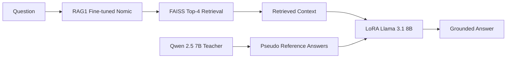

# RAG3 — Clinical-Trial Answer Generation with QLoRA

## Objective

RAG1 improves **what information is retrieved**.

RAG3 improves **how the retrieved information is converted into an answer**.

```text
RAG1 → Retrieval specialization
RAG3 → Generation specialization
```

The objective was to reduce unsupported generation, improve completeness, preserve clinical-trial-specific numbers/criteria, and produce concise context-grounded answers.

---

## Overall Architecture



The Qwen teacher is used **offline for dataset construction only**.

It is not part of final inference.

---

# 1. Teacher Reference Generation

## Teacher Model

```text
Qwen 2.5 7B Instruct
Temperature = 0.1
```

Multiple questions were supplied with their associated clinical-trial context.

The teacher was instructed to:

- use only explicit context,
- avoid outside knowledge,
- avoid unsupported inference,
- preserve numbers and eligibility constraints,
- answer only the relevant question,
- remain concise but sufficiently complete,
- return exactly one answer per question,
- produce valid JSON,
- keep each question tied to its associated context.

---

## Eligibility-Specific Rules

Eligibility questions required additional care.

### Rule 14

Include:

> relevant inclusion/exclusion criteria and key thresholds needed to support the answer

rather than dumping every criterion from the trial.

### Rule 15

For questions such as:

```text
Could this patient qualify?
Is the patient eligible?
Does the patient meet the criteria?
```

the answer must distinguish between:

```text
Criteria explicitly satisfied by the question
            +
Additional criteria that still need to be satisfied
```

### Rule 16

Each question must be answered strictly against its **own associated context**.

No eligibility criteria or conclusions should be transferred from another semantically similar question.

---

# 2. Teacher Generation Failure Analysis

The initial strict teacher prompt sometimes produced truncated JSON, particularly when four answers had to include extensive eligibility criteria.

The main constraint was:

```text
num_predict = 300
```

### Fix

Generation was retried up to three times:

```text
300 → 375 → 450 tokens
```

Only successfully generated groups were written to the production checkpoint/completed set.

Failed groups remained eligible for retry.

Approximately:

```text
6 unique trial/context groups
× 4 anchors
≈ 24 failed records
```

remained after the initial retry process.

---

# 3. Reference-Answer Cleaning

Some successful teacher outputs were technically valid JSON but poor supervision examples.

Examples included:

```text
45
```

instead of a complete grounded answer such as:

```text
The age should be 45 years, provided the relevant inclusion criteria are met.
```

Other problematic outputs included:

```text
True
False
NaN
```

for eligibility/qualification questions.

These were normalized into explicit, context-grounded answers where possible.

This improved the training signal for:

- eligibility questions,
- qualification questions,
- age/temporal questions,
- boolean questions.

---

# 4. Candidate Model

## Base Model

```text
Llama 3.1 8B Instruct
```

## Fine-Tuning

The candidate was specialized using:

> **QLoRA**

Conceptually:

```text
W' = W + ΔW
ΔW = BA
```

where:

- `W` = frozen pretrained weights
- `A/B` = trainable low-rank adapter matrices
- `ΔW` = learned task-specific update

QLoRA additionally loads the base model weights in **4-bit quantized form**, reducing GPU memory requirements.

---

## LoRA Configuration

The adapter targeted:

```text
all-linear
```

Important parameters:

- LoRA rank controls adapter capacity.
- LoRA alpha controls adapter scaling.
- The pretrained model remains frozen.
- Only adapter parameters are trained.

Gradient checkpointing was used to reduce activation memory.

---

# 5. Candidate Training Data

Each training example contained:

```text
anchor
+
retrieved/context chunk
+
reference answer
```

The full chat-formatted prompt was tokenized.

Loss masking ensured that:

```text
Prompt/context → -100
Assistant answer → training labels
```

Therefore the model was trained primarily on generating the desired answer rather than reproducing the prompt.

EOS was used as the padding token.

---

# 6. Candidate Prompt

The candidate instruction was deliberately aligned with the teacher's grounding requirements:

```text
You are a clinical-trial question answering assistant.

Answer the user's QUESTION using the provided CONTEXT.

- Answer directly and naturally.
- Base the answer on the CONTEXT and do not introduce unsupported trial-specific facts.
- Synthesize relevant information rather than simply copying the context.
- Include important numbers, thresholds, dates, age ranges, conditions, interventions, and eligibility criteria when relevant.
- For eligibility questions, explain whether the information given satisfies the relevant criteria and mention other important criteria when relevant.
- Do not include irrelevant trial information.
- If the CONTEXT does not provide enough information, say so clearly.
- Preserve trial-specific details accurately.
- Answer concisely, factually, and sufficiently completely.
```

The strengthened eligibility instruction was intended to address the earlier Rule-15-style weakness.

---

# 7. RAG3 Iteration 1

## Training Configuration

```text
Epochs                    = 1
Per-device batch size     = 2
Gradient accumulation     = 8
Effective batch size      = 16
Learning rate             = 2e-4
Scheduler                 = cosine
Weight decay              = 0.01
Gradient checkpointing    = enabled
Precision                 = FP16
Optimizer                 = Adam8bit
```

Training was constrained by the available GPU memory/runtime.

---

## Iteration-1 Results

| Metric | Base | LoRA | Δ |
|---|---:|---:|---:|
| ROUGE-L | 0.689654 | **0.691370** | +0.001716 |
| BERTScore-F1 | 0.945721 | **0.946055** | +0.000334 |
| Numeric Groundedness | **0.976151** | 0.971657 | -0.004494 |
| Numeric Recall | **0.903712** | 0.897009 | -0.006703 |

### Paired comparison

**ROUGE-L**

```text
Tie       = 351
LoRA wins = 227
Base wins = 205
```

**BERTScore**

```text
LoRA wins = 272
Base wins = 261
Tie       = 250
```

### Interpretation

Iteration 1 produced **near-parity with a modest LoRA advantage on text-similarity metrics**, but not a dramatic generation improvement.

Possible limiting factors included:

- only one training epoch,
- small per-device batch,
- imperfect pseudo-reference answers,
- failed teacher generations,
- filtered scalar/NaN references,
- mismatch between strict teacher instructions and the candidate prompt.

---

# 8. RAG3 Iteration 2

## Motivation

Iteration 1 exposed several weaknesses:

```text
Teacher references
      ↓
NaN / boolean / integer-only answers
      ↓
weak supervision
```

and:

```text
Candidate prompt
      ↓
less explicit eligibility qualification behavior
```

The second iteration therefore targeted:

1. reference-answer normalization,
2. recovery/handling of failed references,
3. stronger eligibility instructions,
4. longer training,
5. two-epoch training, larger per-device batch size, improved reference cleaning, and strengthened eligibility instructions.

---

## Changes

| Component | Iteration 1 | Iteration 2 |
|---|---:|---:|
| Epochs | 1 | **2** |
| Per-device batch | 2 | **4** |
| Gradient accumulation | 8 | 4 |
| Effective batch | 16 | **32** |
| Reference cleaning | Initial | **Improved** |
| Eligibility prompt | Initial | **Strengthened** |

The improvements were intentionally combined because the goal was to improve the overall supervision/training pipeline rather than perform a single-variable ablation.

Therefore, the resulting improvement **cannot be attributed solely to increasing epochs or batch size**.

---

# 9. Iteration-2 Results

## Overall

| Metric | Base | LoRA | Absolute Δ |
|---|---:|---:|---:|
| ROUGE-L | 0.681817 | **0.683128** | +0.001311 |
| BERTScore-F1 | 0.943086 | **0.943949** | +0.000863 |
| Numeric Groundedness | **0.968105** | 0.965843 | -0.002261 |
| Numeric Recall | 0.900501 | **0.903364** | +0.002864 |

Overall generation remained **very close to the Base model**, with small improvements in ROUGE-L, BERTScore and numeric recall, while numeric groundedness decreased slightly.

---

## Question-Type Analysis

| Question type | n | Base ROUGE | LoRA ROUGE | Base BERT | LoRA BERT |
|---|---:|---:|---:|---:|---:|
| Eligibility / Qualification | 228 | 0.635210 | **0.655508** | 0.927499 | **0.932038** |
| Study Design | 227 | **0.823676** | 0.808107 | **0.967911** | 0.967096 |
| Other | 180 | 0.595429 | **0.598936** | **0.934205** | 0.934145 |
| Intervention | 64 | 0.662192 | **0.673651** | 0.943153 | **0.944862** |
| Temporal | 48 | **0.582274** | 0.569226 | **0.933253** | 0.930462 |
| Numeric / Threshold | 37 | **0.682030** | 0.660298 | **0.942677** | 0.938950 |

### Most important observation

The strongest targeted improvement occurred in:

> **Eligibility / Qualification**

For this slice:

```text
ROUGE-L:
0.635210 → 0.655508

BERTScore:
0.927499 → 0.932038

Numeric Recall:
0.851973 → 0.871438
```

This is consistent with the intended intervention of improving eligibility supervision and prompt behavior.

However, numeric groundedness for this slice moved slightly downward:

```text
0.919022 → 0.907919
```

Therefore the correct conclusion is **targeted improvement in eligibility answering, not universal generation improvement**.

---

# 10. Grounding & Completeness

| Metric | Base | LoRA |
|---|---:|---:|
| Mean context-support score | 0.442570 | 0.441146 |
| Low-support sentence rate | 0.022534 | 0.022534 |
| Numeric groundedness | 0.968105 | 0.965843 |
| Numeric recall | 0.900501 | **0.903364** |

The results do **not** support claiming a broad grounding improvement.

Instead:

```text
Numeric recall       ↑ slightly
Numeric groundedness ↓ slightly
Context support      ≈ unchanged
Low-support rate     = unchanged
```

This indicates a small trade-off between completeness and strict numeric grounding.

---

# 11. Paired Evaluation — Iteration 2

### ROUGE-L

```text
Tie       = 365
LoRA wins = 211
Base wins = 208
```

### BERTScore

```text
LoRA wins = 275
Base wins = 268
Tie       = 241
```

The paired results again indicate **near-parity rather than a dramatic transformation**.

---

# 12. End-to-End RAG Role

RAG3 sits after RAG1 retrieval:


The complete conceptual division is:

```text
RAG1
  ↓
Find the right evidence

RAG2
  ↓
Test alternative query-document alignment
  ↓
Rejected from production

RAG3
  ↓
Generate a concise, complete answer from retrieved evidence
```

---

# 13. Final Experimental Story

The RAG3 work evolved through a sequence of identifiable problems:

```text
Generic LLM
    ↓
Potential hallucination / omission
    ↓
Teacher-generated grounded references
    ↓
Teacher generation failures
    ↓
Retry + improved generation budget
    ↓
Poor scalar / boolean / NaN supervision
    ↓
Reference normalization
    ↓
Eligibility answers still insufficiently structured
    ↓
Stronger candidate instructions
    ↓
Iteration-2 training
    ↓
Targeted eligibility improvement + overall near-parity
```

This is an important part of the project's engineering story: the model was not simply trained once and evaluated. The data-generation and supervision pipeline itself was iteratively debugged.

---

# 14. Limitations

- Teacher references are **pseudo-ground truth**, not expert annotations.
- Some teacher generations initially failed/truncated.
- Training and data-cleaning changes were combined in Iteration 2, so causal attribution is limited.
- Overall generation gains remain modest.
- Numeric groundedness did not improve consistently.
- Some question types remained stronger with the Base model.
- Final end-to-end performance must be reassessed after running the updated RAG3 model through the complete CT pipeline.

---

# 15. Final Design

```text
                 OFFLINE
┌──────────────────────────────────────┐
│ Qwen 2.5 7B Instruct                 │
│ Context + Questions                  │
│            ↓                         │
│ Grounded Reference Answers           │
└──────────────────┬───────────────────┘
                   ↓
              QLoRA Training
                   ↓
┌──────────────────────────────────────┐
│ Llama 3.1 8B Instruct + LoRA         │
└──────────────────┬───────────────────┘
                   │
                   │ FINAL INFERENCE
                   ↓
Question → RAG1 Retrieval → Top-4 Context
                              ↓
                     LoRA Llama 3.1
                              ↓
                       Final Answer
```

### Takeaway

> RAG3 specialized the generation layer using context-grounded pseudo-references and QLoRA. Iteration 1 established near-parity with the pretrained generator, while Iteration 2 improved eligibility/qualification behavior after targeted reference cleaning, prompt 
strengthening, and longer/larger-batch training. The updated model still requires a complete end-to-end CT-pipeline rerun before its effect can be reported in the root project results.

### **Datasets**
* [Iteration 1](https://huggingface.co/datasets/vab46/Clinical_trials_anchor-contextORpositive-ground-truth_LLM_LORA_ft)
* [Iter2/Final dataset](https://huggingface.co/datasets/vab46/Clinical_trials_anchor-contextORpositive-ground-truth_LLM_LORA-junk_handled_ft)

### **Models**

* [Iteration 1](https://huggingface.co/vab46/llama-3.1-8b-instruct-lora-clinical_iter1)
* [Iter2/Final model](https://huggingface.co/vab46/llama-3.1-8b-instruct-lora-clinical_iter2_epoch2)