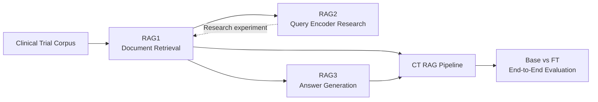
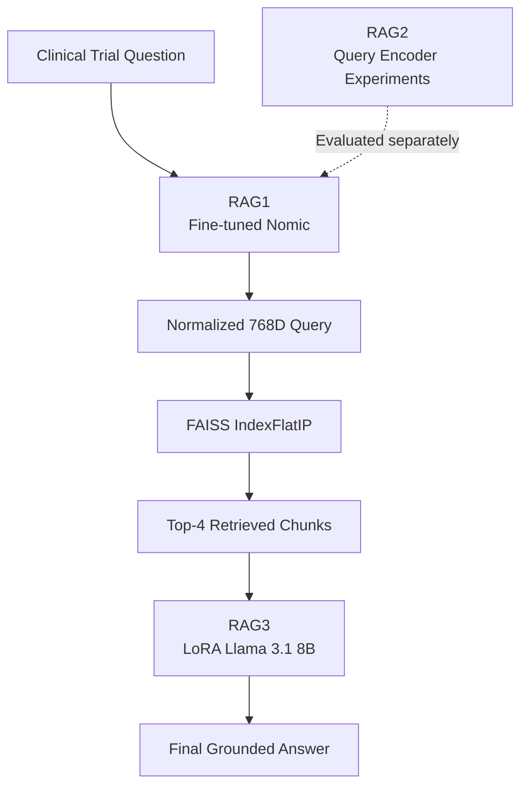
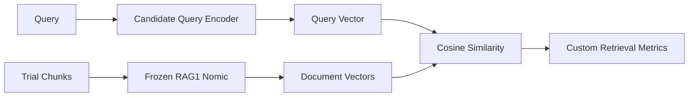
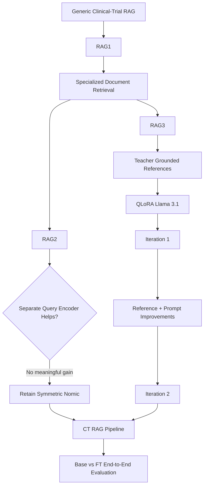

# Clinical-Trial RAG Pipeline

A three-stage experimental **Retrieval-Augmented Generation (RAG)** system for answering clinical-trial questions using domain-specialized retrieval and grounded generation.

The project evolved through three experimental components:



## Project Structure

```text
Ct_RAG_pipeline/
│
├── README.md
│
├── RAG1/
│   └── README.md
│
├── RAG2/
│   └── README.md
│
└── RAG3/
    └── README.md
```

---

# 1. Project Objective

The central question was:

> Can clinical-trial-specific retrieval and generation specialization improve answers over a standard pretrained RAG system?

The project therefore separated the problem into:

| Component       | Focus                     | Role                      |
| --------------- | ------------------------- | ------------------------- |
| **RAG1**        | Embedding fine-tuning     | Improve retrieval         |
| **RAG2**        | Query encoder experiments | Test asymmetric retrieval |
| **RAG3**        | QLoRA generation          | Improve answer generation |
| **CT Pipeline** | End-to-end integration    | Compare Base vs FT        |

---

# 2. Overall Architecture



The final production architecture retained:

```text
Question
   ↓
Fine-tuned Nomic Embedding
   ↓
Normalized 768D vector
   ↓
FAISS IndexFlatIP
   ↓
Top-4 clinical-trial chunks
   ↓
LoRA Llama 3.1 8B
   ↓
Answer
```

---

# 3. RAG1 — Retrieval Specialization

## Objective

Generic embeddings can retrieve semantically similar but clinically irrelevant trial information.

RAG1 fine-tuned **Nomic Embed Text v1.5** for clinical-trial-specific semantic retrieval.

### Data

Approximately:

```text
~10K clinical-trial records
        ↓
KNN clustering / deduplication
        ↓
~2K representative records
```

Final retrieval chunk:

```text
Title + Summary + Inclusion Criteria
```

### Anchor Generation

The project experimented with different levels of semantic granularity.

- Iteration 1: consolidated trial representation.
- Iteration 2: separated title/summary/inclusion anchors.
- Iteration 3: restored consolidated trial-level representation while retaining improved eligibility cleaning.

The Iteration-2 experiment showed that **greater granularity could fragment trial-level semantics and reduce retrieval quality**.

### Training

```text
Matryoshka Multiple Negatives Ranking Loss
```

Dimensions evaluated:

```text
768 / 512 / 256 / 128 / 64
```

Final production retrieval:

```text
768D
FAISS IndexFlatIP
Top-k = 4
```

With normalized vectors:

```text
Inner Product ≈ Cosine Similarity
```

### Final RAG1 Retrieval Results

| Dim |   R\@1 |   R\@3 |   R\@5 |  R\@10 |   NDCG\@10 |    MRR\@10 |
| --: | -----: | -----: | -----: | -----: | ---------: | ---------: |
| 768 | 0.5476 | 0.6620 | 0.6938 | 0.7395 | **0.6433** | **0.6126** |
| 512 | 0.5349 | 0.6417 | 0.6874 | 0.7395 |     0.6346 |     0.6015 |
| 256 | 0.5235 | 0.6531 | 0.6836 | 0.7306 |     0.6280 |     0.5951 |
| 128 | 0.4905 | 0.6048 | 0.6607 | 0.7116 |     0.5974 |     0.5612 |
|  64 | 0.4409 | 0.5667 | 0.6213 | 0.6773 |     0.5563 |     0.5179 |

### Key RAG1 Insight

> Preserving trial-level semantic relationships was more effective than aggressively fragmenting clinical-trial information.

---

# 4. RAG2 — Query Encoder Research

## Objective

RAG2 tested whether a separate query encoder could improve alignment with the frozen RAG1 document embedding space.



Three query encoders were tested:

- Pretrained Nomic
- PubMedModernBERT
- BGE

The cross-model experiments suffered from **embedding-space mismatch**.

Fine-tuning improved alignment, but the best asymmetric Nomic configuration:

```text
NDCG@10 = 0.65951
```

remained slightly below the symmetric RAG1 configuration:

```text
NDCG@10 = 0.66290
```

Therefore RAG2 was **not retained in production**.

### Key RAG2 Insight

> The experiment demonstrated that independently trained query and document encoders do not automatically share a compatible embedding space, and the added complexity did not provide a retrieval gain.

RAG2 therefore remains a documented research experiment rather than a production component.

---

# 5. RAG3 — Generation Specialization

## Objective

Correct retrieval does not guarantee a good answer.

A general LLM may:

- hallucinate unsupported facts,
- omit relevant eligibility criteria,
- mishandle numbers,
- over-answer,
- infer unsupported eligibility,
- fail to distinguish satisfied vs remaining criteria.

RAG3 therefore specialized the answer-generation layer.

---

## Teacher → Candidate Pipeline


### Teacher

```text
Qwen 2.5 7B Instruct
Temperature = 0.1
```

The teacher prompt enforced:

- context-only answering,
- no unsupported inference,
- exact numerical preservation,
- concise but complete answers,
- valid JSON,
- independent treatment of each question/context,
- explicit relevant eligibility criteria,
- distinction between currently satisfied and additional eligibility criteria.

Teacher generation also required retry logic because long eligibility answers could exceed the initial generation budget.

Reference cleaning addressed problematic outputs such as:

```text
45
True
False
NaN
```

by converting them into useful, context-grounded supervision where possible.

---

## Candidate Model

```text
Llama 3.1 8B Instruct
        +
QLoRA
```

The base model was loaded in 4-bit form while low-rank LoRA adapters were trained.

Conceptually:

```text
W' = W + ΔW
ΔW = BA
```

Training used assistant-only loss masking:

```text
Prompt / Context → -100
Answer           → trainable labels
```

---

# 6. RAG3 Iteration 1

### Configuration

```text
Epochs                 = 1
Per-device batch       = 2
Gradient accumulation  = 8
Effective batch        = 16
Learning rate          = 2e-4
Gradient checkpointing = enabled
Adam8bit optimizer
```

### Results

| Metric               |         Base |         LoRA |
| -------------------- | -----------: | -----------: |
| ROUGE-L              |     0.689654 | **0.691370** |
| BERTScore-F1         |     0.945721 | **0.946055** |
| Numeric Groundedness | **0.976151** |     0.971657 |
| Numeric Recall       | **0.903712** |     0.897009 |

The first iteration produced **near-parity**, rather than a dramatic generation improvement.

---

# 7. RAG3 Iteration 2

## Why another iteration?

Iteration 1 revealed weaknesses in:

- teacher reference quality,
- boolean/NaN/integer-only answers,
- eligibility supervision,
- candidate prompt alignment,
- training duration,
- per-device batch size.

### Changes

| Component                    |  Iter-1 |           Iter-2 |
| ---------------------------- | ------: | ---------------: |
| Epochs                       |       1 |            **2** |
| Per-device batch             |       2 |            **4** |
| Gradient accumulation        |       8 |                4 |
| Effective batch              |      16 |           **16** |
| Reference cleaning           | Initial |     **Improved** |
| Candidate eligibility prompt | Initial | **Strengthened** |

Because several interventions changed simultaneously, the Iteration-2 results should not be attributed solely to the extra epoch or larger batch.

---

## Iteration-2 Overall Results

| Metric               |         Base |         LoRA |         Δ |
| -------------------- | -----------: | -----------: | --------: |
| ROUGE-L              |     0.681817 | **0.683128** | +0.001311 |
| BERTScore-F1         |     0.943086 | **0.943949** | +0.000863 |
| Numeric Groundedness | **0.968105** |     0.965843 | -0.002261 |
| Numeric Recall       |     0.900501 | **0.903364** | +0.002864 |

### Important Slice: Eligibility / Qualification

```text
ROUGE-L:
0.635210 → 0.655508

BERTScore:
0.927499 → 0.932038

Numeric Recall:
0.851973 → 0.871438
```

This indicates a **targeted improvement in eligibility/qualification answering**.

However, context-support and numeric-groundedness metrics did not show a broad improvement.

### Current Status

The Iteration-2 RAG3 model has **not yet been rerun through the complete CT pipeline**.

Therefore its metrics are currently standalone RAG3 generation results and should not be presented as the final end-to-end pipeline result.

---

# 8. CT RAG Pipeline — Base vs FT

The final integration compares two complete systems under the same retrieval/generation evaluation setup.

## Base Pipeline


## Fine-Tuned Pipeline


Both pipelines use the same:

```text
Corpus
Question set
Embedding dimension = 768
Vector normalization
FAISS IndexFlatIP
Top-k = 4
Retrieved-context format
Generation evaluation
```

The controlled comparison isolates the effect of the specialized retrieval + generation stack as much as practical.

---

# 9. End-to-End CT-Pipeline Results

The complete CT-RAG pipeline was evaluated with both the earlier RAG3 Iteration-1 model and the updated RAG3 Iteration-2 model.

| RAG3 Generation | Model | ROUGE-L | BERTScore |
| ---------------- | ----- | -------: | ---------: |
| Iteration 1 | Base | 0.483989 | 0.906158 |
| Iteration 1 | FT | **0.502342** | **0.910006** |
| Iteration 2 | Base | 0.479794 | 0.906269 |
| Iteration 2 | FT | **0.512608** | **0.911030** |

### Iteration-2 End-to-End Improvement

For the complete pipeline:

```text
ROUGE-L
Base: 0.479794
FT:   0.512608
FT − Base: +0.032814 (~6.84%)
```

Compared with Iteration 1:

```text
FT ROUGE-L
0.502342 → 0.512608
Δ = +0.010266
```

```text
FT BERTScore
0.910006 → 0.911030
Δ = +0.001024
```

The Base pipeline remained broadly stable across the two runs, while the Iteration-2 Fine-Tuned pipeline showed stronger end-to-end performance.

### Interpretation

The Iteration-2 RAG3 model produced a stronger end-to-end Fine-Tuned CT-RAG result, particularly in ROUGE-L. This provides complementary evidence that the improved RAG3 training/reference pipeline translated into better final CT-RAG answer quality.

Because multiple changes were introduced in RAG3 Iteration 2, the end-to-end improvement should not be attributed solely to the additional training epoch or larger per-device batch size.

---

# 10. End-to-End Experimental Evolution



---

# 11. Major Engineering Decisions

### Retrieval

- Fine-tuned Nomic rather than relying only on generic embeddings.
- Consolidated trial representation retained after granularity experiment.
- 768D selected for production.
- Normalized embeddings + `IndexFlatIP`.
- Top-4 retrieval.

### Query Encoding

- Tested asymmetric query/document architecture.
- Evaluated Nomic, ModernBERT and BGE query encoders.
- Rejected RAG2 from production after no meaningful retrieval gain.

### Generation

- Used Qwen offline to create grounded pseudo-references.
- Added retry handling for failed teacher generations.
- Cleaned weak scalar/boolean/NaN references.
- Used QLoRA to specialize Llama 3.1 8B.
- Strengthened eligibility/qualification instructions.
- Iterated from 1 → 2 epochs while changing per-device batch size from 2 → 4 and gradient accumulation from 8 → 4; effective batch size remained 16.

### Evaluation

The project evaluates both:

```text
Component-level behavior
        +
End-to-end RAG behavior
```

This distinction is important because improvements in an individual component do not automatically imply improved final RAG answers.

---

# 12. Current System Status

| Component                      | Status                       |
| ------------------------------ | ---------------------------- |
| RAG1 fine-tuned retrieval      | **Finalized**                |
| RAG2 query encoder research    | **Completed / not retained** |
| RAG3 Iteration 1               | **Evaluated**                |
| RAG3 Iteration 2               | **Evaluated standalone + end-to-end** |
| Earlier Base vs FT CT pipeline | **Evaluated**                |
| Updated RAG3 → CT pipeline     | **Evaluated**                |

---

# 13. Final Conceptual Takeaway

The project treats RAG as multiple independently optimizable layers:

```text
                 CLINICAL-TRIAL RAG
                        │
          ┌─────────────┴─────────────┐
          ↓                           ↓
       RETRIEVAL                  GENERATION
          │                           │
        RAG1                         RAG3
          │                           │
 Fine-tuned Nomic              QLoRA Llama 3.1
          │                           │
          └─────────────┬─────────────┘
                        ↓
                 END-TO-END RAG
                        │
                        ↓
                Base vs Fine-tuned
```

RAG1 established the specialized retrieval layer, RAG2 tested and rejected a more complex asymmetric retrieval architecture, and RAG3 iteratively specialized generation with grounded pseudo-supervision and QLoRA.

The **updated end-to-end CT-pipeline evaluation now incorporates RAG3 Iteration 2**, while the earlier Iteration-1 result is retained for comparison.

That separation keeps the component-level experiments and end-to-end claims technically consistent.
