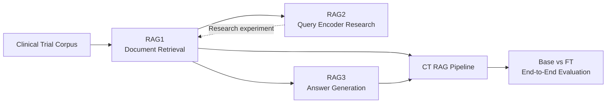
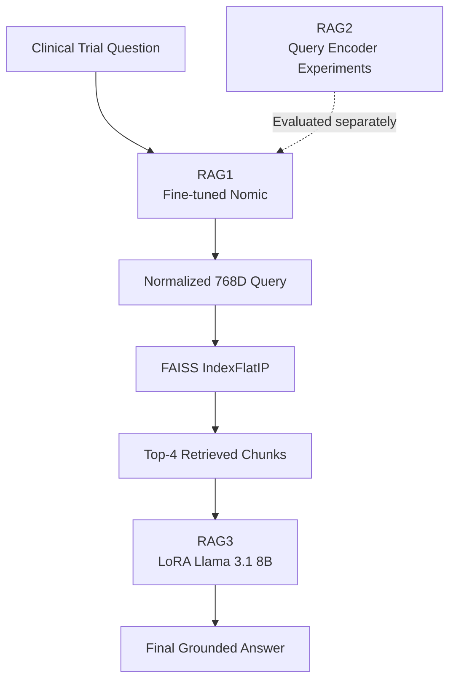
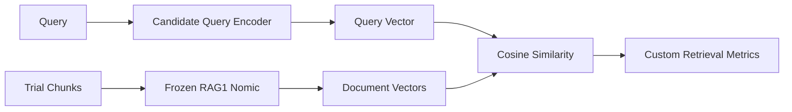
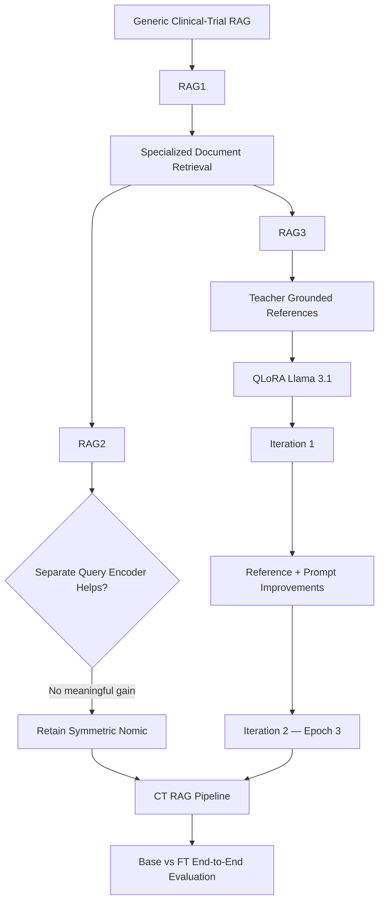

# Clinical-Trial RAG Pipeline

A three-stage experimental **Retrieval-Augmented Generation (RAG)** system for answering clinical-trial questions using domain-specialized retrieval and grounded generation.

The project evolved through three experimental components:


```mermaid
flowchart LR
    A[Clinical Trial Corpus] --> B[RAG1<br/>Document Retrieval]
    B --> C[RAG2<br/>Query Encoder Research]
    B --> D[RAG3<br/>Answer Generation]
    C -. Research experiment .-> B

    B --> E[CT RAG Pipeline]
    D --> E
    E --> F[Base vs FT<br/>End-to-End Evaluation]
```

## Project Structure

```text
Ct_RAG_pipeline/
│
├── README.md
│
├── RAG1/
│   └── README.md
│
├── RAG2/
│   └── README.md
│
└── RAG3/
    └── README.md
```

---

# 1. Project Objective

The central question was:

> Can clinical-trial-specific retrieval and generation specialization improve answers over a standard pretrained RAG system?

The project therefore separated the problem into:

| Component       | Focus                     | Role                      |
| --------------- | ------------------------- | ------------------------- |
| **RAG1**        | Embedding fine-tuning     | Improve retrieval         |
| **RAG2**        | Query encoder experiments | Test asymmetric retrieval |
| **RAG3**        | QLoRA generation          | Improve answer generation |
| **CT Pipeline** | End-to-end integration    | Compare Base vs FT        |

---

# 2. Overall Architecture


```mermaid
flowchart TD
    Q[Clinical Trial Question]

    Q --> R1[RAG1<br/>Fine-tuned Nomic]
    R1 --> V[Normalized 768D Query]
    V --> F[FAISS IndexFlatIP]
    F --> K[Top-4 Retrieved Chunks]

    K --> R3[RAG3<br/>LoRA Llama 3.1 8B]
    R3 --> A[Final Grounded Answer]

    R2[RAG2<br/>Query Encoder Experiments] -. Evaluated separately .-> R1
```

The final production architecture retained:

```text
Question
   ↓
Fine-tuned Nomic Embedding
   ↓
Normalized 768D vector
   ↓
FAISS IndexFlatIP
   ↓
Top-4 clinical-trial chunks
   ↓
LoRA Llama 3.1 8B
   ↓
Answer
```

---

# 3. RAG1 — Retrieval Specialization

## Objective

Generic embeddings can retrieve semantically similar but clinically irrelevant trial information.

RAG1 fine-tuned **Nomic Embed Text v1.5** for clinical-trial-specific semantic retrieval.

### Data

Approximately:

```text
~10K clinical-trial records
        ↓
KNN clustering / deduplication
        ↓
~2K representative records
```

Final retrieval chunk:

```text
Title + Summary + Inclusion Criteria
```

### Anchor Generation

The project experimented with different levels of semantic granularity.

- Iteration 1: consolidated trial representation.
- Iteration 2: separated title/summary/inclusion anchors.
- Iteration 3: restored consolidated trial-level representation while retaining improved eligibility cleaning.

The Iteration-2 experiment showed that **greater granularity could fragment trial-level semantics and reduce retrieval quality**.

### Training

```text
Matryoshka Multiple Negatives Ranking Loss
```

Dimensions evaluated:

```text
768 / 512 / 256 / 128 / 64
```

Final production retrieval:

```text
768D
FAISS IndexFlatIP
Top-k = 4
```

With normalized vectors:

```text
Inner Product ≈ Cosine Similarity
```

### Final RAG1 Retrieval Results

| Dim |   R\@1 |   R\@3 |   R\@5 |  R\@10 |   NDCG\@10 |    MRR\@10 |
| --: | -----: | -----: | -----: | -----: | ---------: | ---------: |
| 768 | 0.5476 | 0.6620 | 0.6938 | 0.7395 | **0.6433** | **0.6126** |
| 512 | 0.5349 | 0.6417 | 0.6874 | 0.7395 |     0.6346 |     0.6015 |
| 256 | 0.5235 | 0.6531 | 0.6836 | 0.7306 |     0.6280 |     0.5951 |
| 128 | 0.4905 | 0.6048 | 0.6607 | 0.7116 |     0.5974 |     0.5612 |
|  64 | 0.4409 | 0.5667 | 0.6213 | 0.6773 |     0.5563 |     0.5179 |

### Key RAG1 Insight

> Preserving trial-level semantic relationships was more effective than aggressively fragmenting clinical-trial information.

---

# 4. RAG2 — Query Encoder Research

## Objective

RAG2 tested whether a separate query encoder could improve alignment with the frozen RAG1 document embedding space.


```mermaid
flowchart LR
    Q[Query] --> QE[Candidate Query Encoder]
    D[Trial Chunks] --> DE[Frozen RAG1 Nomic]

    QE --> QV[Query Vector]
    DE --> DV[Document Vectors]

    QV --> S[Cosine Similarity]
    DV --> S
    S --> M[Custom Retrieval Metrics]
```

Three query encoders were tested:

- Pretrained Nomic
- PubMedModernBERT
- BGE

The cross-model experiments suffered from **embedding-space mismatch**.

Fine-tuning improved alignment, but the best asymmetric Nomic configuration:

```text
NDCG@10 = 0.65951
```

remained slightly below the symmetric RAG1 configuration:

```text
NDCG@10 = 0.66290
```

Therefore RAG2 was **not retained in production**.

### Key RAG2 Insight

> The experiment demonstrated that independently trained query and document encoders do not automatically share a compatible embedding space, and the added complexity did not provide a retrieval gain.

RAG2 therefore remains a documented research experiment rather than a production component.

---

# 5. RAG3 — Generation Specialization

## Objective

Correct retrieval does not guarantee a good answer.

A general LLM may:

- hallucinate unsupported facts,
- omit relevant eligibility criteria,
- mishandle numbers,
- over-answer,
- infer unsupported eligibility,
- fail to distinguish satisfied vs remaining criteria.

RAG3 therefore specialized the answer-generation layer.

---

## Teacher → Candidate Pipeline


```mermaid
flowchart LR
    C[Clinical Context + Questions]
    C --> T[Qwen 2.5 7B Instruct]
    T --> R[Grounded Reference Answers]
    R --> D[Reference Cleaning]
    D --> L[QLoRA Llama 3.1 8B]
    L --> A[Grounded Answer]
```

### Teacher

```text
Qwen 2.5 7B Instruct
Temperature = 0.1
```

The teacher prompt enforced:

- context-only answering,
- no unsupported inference,
- exact numerical preservation,
- concise but complete answers,
- valid JSON,
- independent treatment of each question/context,
- explicit relevant eligibility criteria,
- distinction between currently satisfied and additional eligibility criteria.

Teacher generation also required retry logic because long eligibility answers could exceed the initial generation budget.

Reference cleaning addressed problematic outputs such as:

```text
45
True
False
NaN
```

by converting them into useful, context-grounded supervision where possible.

---

## Candidate Model

```text
Llama 3.1 8B Instruct
        +
QLoRA
```

The base model was loaded in 4-bit form while low-rank LoRA adapters were trained.

Conceptually:

```text
W' = W + ΔW
ΔW = BA
```

Training used assistant-only loss masking:

```text
Prompt / Context → -100
Answer           → trainable labels
```

---

# 6. RAG3 Iteration 1

### Configuration

```text
Epochs                 = 1
Per-device batch       = 2
Gradient accumulation  = 8
Effective batch        = 16
Learning rate          = 2e-4
Gradient checkpointing = enabled
Adam8bit optimizer
```

### Results

| Metric               |         Base |         LoRA |
| -------------------- | -----------: | -----------: |
| ROUGE-L              |     0.689654 | **0.691370** |
| BERTScore-F1         |     0.945721 | **0.946055** |
| Numeric Groundedness | **0.976151** |     0.971657 |
| Numeric Recall       | **0.903712** |     0.897009 |

The first iteration produced **near-parity**, rather than a dramatic generation improvement.

---

# 7. RAG3 Iteration 2

## Why another iteration?

Iteration 1 revealed weaknesses in:

- teacher reference quality,
- boolean/NaN/integer-only answers,
- eligibility supervision,
- candidate prompt alignment,
- training duration,
- per-device batch size.

### Changes

| Component                    |  Iter-1 |           Iter-2 |
| ---------------------------- | ------: | ---------------: |
| Epochs                       |       1 |            **2** |
| Per-device batch             |       2 |            **4** |
| Gradient accumulation        |       8 |                4 |
| Effective batch              |      16 |           **16** |
| Reference cleaning           | Initial |     **Improved** |
| Candidate eligibility prompt | Initial | **Strengthened** |

Because several interventions changed simultaneously, the Iteration-2 results should not be attributed solely to the extra epoch or larger batch.

---

## Iteration-2 Overall Results

| Metric               |         Base |         LoRA |         Δ |
| -------------------- | -----------: | -----------: | --------: |
| ROUGE-L              |     0.681817 | **0.683128** | +0.001311 |
| BERTScore-F1         |     0.943086 | **0.943949** | +0.000863 |
| Numeric Groundedness | **0.968105** |     0.965843 | -0.002261 |
| Numeric Recall       |     0.900501 | **0.903364** | +0.002864 |

### Important Slice: Eligibility / Qualification

```text
ROUGE-L:
0.635210 → 0.655508

BERTScore:
0.927499 → 0.932038

Numeric Recall:
0.851973 → 0.871438
```

This indicates a **targeted improvement in eligibility/qualification answering**.

However, context-support and numeric-groundedness metrics did not show a broad improvement.

### Current Status

The retained Iteration-2 Epoch-3 RAG3 model has been rerun through the complete CT pipeline.

Therefore its metrics are currently standalone RAG3 generation results and should not be presented as the final end-to-end pipeline result.

---

# 8. CT RAG Pipeline — Base vs FT

The final integration compares two complete systems under the same retrieval/generation evaluation setup.

## Base Pipeline


```mermaid
flowchart LR
    Q[Question] --> E[Pretrained Nomic]
    E --> V[Normalized 768D]
    V --> F[Base FAISS]
    F --> K[Top-4 Context]
    K --> L[Pretrained Llama 3.1]
    L --> A[Answer]
```

## Fine-Tuned Pipeline


```mermaid
flowchart LR
    Q[Question] --> E[Fine-tuned Nomic]
    E --> V[Normalized 768D]
    V --> F[FT FAISS]
    F --> K[Top-4 Context]
    K --> L[LoRA Llama 3.1]
    L --> A[Answer]
```

Both pipelines use the same:

```text
Corpus
Question set
Embedding dimension = 768
Vector normalization
FAISS IndexFlatIP
Top-k = 4
Retrieved-context format
Generation evaluation
```

The controlled comparison isolates the effect of the specialized retrieval + generation stack as much as practical.

---

# 9. End-to-End CT-Pipeline Results

The complete CT-RAG pipeline was evaluated with the earlier RAG3 Iteration-1 model and the retained RAG3 Iteration-2 Epoch-3 model.

| RAG3 Generation | Model | ROUGE-L | BERTScore |
| ---------------- | ----- | -------: | ---------: |
| Iteration 1 | Base | 0.483989 | 0.906158 |
| Iteration 1 | FT | **0.502342** | **0.910006** |
| Iteration 2 | Base | 0.479794 | 0.906269 |
| Iteration 2 | FT | **0.512608** | **0.911030** |

### Iteration-2 Epoch-3 End-to-End Improvement

For the complete pipeline:

```text
ROUGE-L
Base: 0.479794
FT:   0.512608
FT − Base: +0.032814 (~6.84%)
```

Compared with Iteration 1:

```text
FT ROUGE-L
0.502342 → 0.512608
Δ = +0.010266
```

```text
FT BERTScore
0.910006 → 0.911030
Δ = +0.001024
```

The Base pipeline remained broadly stable across the two runs, while the Iteration-2 Fine-Tuned pipeline showed stronger end-to-end performance.

### Interpretation

The retained Iteration-2 Epoch-3 RAG3 model produced a stronger end-to-end Fine-Tuned CT-RAG result, particularly in ROUGE-L. This provides complementary evidence that the improved RAG3 training/reference pipeline translated into better final CT-RAG answer quality.

Because multiple changes were introduced in RAG3 Iteration 2, the end-to-end improvement should not be attributed solely to the additional training epoch or larger per-device batch size.

---

# 10. End-to-End LLM-Judge Evaluation

The same 400-question end-to-end evaluation was additionally assessed using Qwen 2.5 7B Instruct as a fixed LLM judge at temperature = 0.

```text
Qwen 2.5 7B Instruct was used offline in two distinct roles:

1. Teacher/reference generation: temperature = 0.1
2. End-to-end evaluation judge: temperature = 0

The teacher generated context-grounded pseudo-reference answers for training;
the judge independently scored Base vs FT retrieval and generated answers.
```

| Judge dimension | Base | Final FT (RAG1 + RAG3 Epoch-3) | Δ | %Δ |
|---|---:|---:|---:|---:|
| Retrieval relevance | 55.610 | **66.178** | **+10.568** | **+19%** |
| Groundedness | 57.515 | **68.210** | **+10.695** | **+18.6%** |
| Response relevance | 63.190 | **73.525** | **+10.335** | **+16.36%** |
| Correctness | 62.010 | **70.955** | **+8.945** | **+14.43%** |

These results complement ROUGE-L/BERTScore: the specialized pipeline showed substantially better judged retrieval usefulness and answer quality, while the automatic text metrics showed smaller absolute changes.

### Epoch-2 → Epoch-3 Judge Comparison

The same temperature-0 judge protocol was applied to both retained Iteration-2 epochs. Epoch 3 was directionally better on the Fine-Tuned system across all four judge dimensions:

| Judge dimension | Epoch 2 FT | Epoch 3 FT | Δ |
|---|---:|---:|---:|
| Retrieval relevance | 65.73 | **66.18** | **+0.45** |
| Groundedness | 67.76 | **68.21** | **+0.45** |
| Response relevance | 72.80 | **73.53** | **+0.72** |
| Correctness | 70.21 | **70.96** | **+0.75** |

The Base scores also moved slightly between the two judge runs even though the Base system was unchanged. Therefore, these small Epoch-2 → Epoch-3 judge differences are best treated as **directional supporting evidence**, not as a clean causal measurement of the third epoch. The stronger conclusion is that both epochs show a stable ~9–11 point Fine-Tuned advantage over Base under the same evaluation protocol.

## What the Final CT-RAG Pipeline Did Well

The final Fine-Tuned pipeline combines the **RAG1 Iter-3 768D Nomic retrieval model** with the **RAG3 Iter-2 Epoch-3 QLoRA Llama 3.1 generator**.

### Retrieval

The associated/mother trial appeared in the retrieved top-4 for:

```text
Base: 220 / 400 = 55.0%
FT:   283 / 400 = 70.75%
```

The outcome breakdown was:

```text
Both Base + FT        = 216
FT recovered only     = 67
Base only             = 4
Neither               = 113
```

Mother-trial top-4 retrieval by anchor type:

| Anchor type | Base | Final FT |
|---|---:|---:|
| Conversational | 81.4% | **92.2%** |
| Patient-profile | 64.7% | **92.9%** |
| Macro | 64.7% | **70.6%** |
| Operational | 14.4% | **34.2%** |

The mother-trial retrieval signal improved strongly for patient-profile and conversational anchors, while operational retrieval remained difficult. However, the end-to-end judge shows an important distinction: conversational questions had only small judge-score gains because Base retrieval was already comparatively strong, whereas macro/operational/patient-profile questions had more room for improvement.

### End-to-End Answer Quality

```text
ROUGE-L:
Base = 0.479794
FT   = 0.512608
Δ    = +0.032814 (~6.84%)

BERTScore-F1:
Base = 0.906269
FT   = 0.911030
Δ    = +0.004761
```

Compared with the earlier Iteration-1 FT pipeline, the retained Epoch-3 FT result improved from **0.502342 → 0.512608 ROUGE-L** and **0.910006 → 0.911030 BERTScore-F1**, while the Base pipeline remained broadly stable.

### LLM-Judge Performance by Question Type

| Question type | n | Retrieval Δ | Groundedness Δ | Response Δ | Correctness Δ |
|---|---:|---:|---:|---:|---:|
| Eligibility / Qualification | 103 | +9.82 | +7.79 | +7.01 | +4.53 |
| Intervention | 34 | +9.79 | +10.85 | +11.59 | +10.24 |
| Numeric / Threshold | 22 | **+21.59** | **+23.95** | **+20.45** | **+18.64** |
| Other | 93 | +2.40 | +1.99 | +2.84 | +0.90 |
| Study Design | 123 | +9.24 | +9.57 | +8.87 | +7.82 |
| Temporal | 25 | +5.92 | +3.88 | +5.64 | +3.76 |

The largest judged gains were in **Numeric / Threshold** questions, followed by Intervention and Study Design. The smaller gains in Other questions show that improvement was not uniform. **Study Design** is a useful mixed case: judged retrieval relevance rose from **50.00 → 62.05 (+12.05)**, but the final FT absolute score remains only moderately high. This illustrates that a large relative improvement does not imply that retrieval is solved.

### Anchor-Type Behaviour

Across conversational, macro, operational and patient-profile anchors, the final FT system improved the mean judge scores. Conversational questions showed smaller gains because Base retrieval was already comparatively strong; this means that **retrieving the mother trial is not sufficient when the generator fails to use the evidence correctly**. Patient-profile correctness improved by **+7.44 points**—a meaningful gain, but smaller than the larger macro/operational gains—so this category should be described as improved rather than uniformly solved.

The end-to-end examples also expose two important failure modes: (1) the mother trial can be retrieved at **rank 1/top-4 while generation remains weak**, and (2) an FT answer can be reasonably formed yet receive a low groundedness score from the automatic judge. For example, some retrieved-mother cases involved conservative answers such as “not enough information” despite the context containing relevant evidence, while another eligibility case produced an unsupported age criterion. These examples show that **retrieval quality and generation/grounding quality are related but separable failure sources**.

A representative set of validated examples included: an acid-reflux eligibility question where FT retrieved the mother trial first but failed to connect “acid reflux” with the trial's explicit GERD/age criteria; an intraoperative-music question where FT retrieved the mother trial first but remained overly conservative despite context discussing emergence delirium; an under-18 eligibility question where the retrieved FT answer introduced an unsupported “18 years or older” criterion; and a PSVD question where FT retrieved the correct trial first but generated irrelevant discussion of other trials. These are qualitative failure examples, not additional aggregate metrics.

The end-to-end sheet also shows that FT was not better on every row; the remaining losses are expected in a difficult corpus with clinically similar sibling trials. Overall, the strongest evidence is the combination of higher mother-trial top-4 retrieval, **67 FT-only recoveries versus 4 Base-only losses**, improved automatic answer metrics, and consistent LLM-judge gains.

This supports the broader RAG1 finding that the key challenge is **discriminating among clinically similar trials**, not merely finding semantically related text.

---

# 11. CT-Pipeline Limitations and Evaluation Caveats

### 1. Retrieval remains imperfect

Even after fine-tuning, the associated trial appeared in the top-4 for **70.75%** of the 400 questions. In **113/400 cases (28.25%)**, neither Base nor FT retrieved the associated trial in the top-4.

A strong generator cannot recover evidence that is absent from the retrieved context.

### 2. Clinical-trial similarity creates genuine retrieval ambiguity

The corpus contains sister/sibling trials with highly similar disease/population, intervention, study-design and eligibility language. A natural question can therefore be genuinely relevant to multiple trials even when the evaluation assigns one associated trial as the positive.

This creates an **evaluation ambiguity floor**: an exact-trial retrieval metric can mark a clinically relevant sibling as incorrect.

### 3. Synthetic anchors have a specificity trade-off

Anchors were generated at low temperature (0.1) to remain reproducible and context-conditioned, but not deliberately brittle or extractive. Making every query uniquely identify one trial would make the benchmark less representative of natural questions.

The evaluation therefore retains some legitimate cross-trial ambiguity rather than artificially eliminating it.

### 4. Operational questions remain difficult

Operational-anchor mother-trial retrieval improved from **14.4% → 34.2%**, but remained substantially below the other anchor categories. Such questions may contain fewer distinctive trial-level signals.

### 5. RAG3 training showed a recurring late-tail loss divergence

Across RAG3 iterations, training loss followed a recurring pattern: an initial low-loss region followed by a late rise/divergence toward the tail of the epoch. This was treated as a sign that the final batches were contributing less useful specialization than the earlier stable region. Iteration-2 optimization attempts tried to flatten this behaviour, including schedule/training adjustments and the later Epoch-4 experiment, but the tail-rise pattern was not completely eliminated. This is a training-dynamics limitation rather than evidence that the model simply stopped learning everywhere.

### 6. Retrieval and generation errors are coupled

A fluent answer can still be wrong if the retrieved context belongs to a sibling trial. Conversely, a capable generator can appear weak when the required evidence was not retrieved. The separate judge dimensions help distinguish these failure sources, but end-to-end metrics necessarily combine them.

### 7. Automatic metrics and LLM judging are not expert clinical ground truth

ROUGE-L/BERTScore measure similarity to reference answers, while the LLM judge provides semantic/grounding assessment. Neither is equivalent to expert clinical annotation. The reference answers are **teacher-generated pseudo-ground truth**, not manually verified clinical answers.

### 8. Judge scores are evaluator-dependent

The judge was kept fixed at temperature 0 for controlled comparison. Its absolute 0–100 scores should not be treated as universal quality thresholds; the strongest interpretation is the controlled Base-versus-FT difference under the same protocol.

### 9. Fine-tuning does not improve every individual example

In the 400-row evaluation, FT was lower than Base on:

```text
Retrieval relevance: 172
Groundedness:        180
Response relevance:  168
Correctness:         178
```

Thus the aggregate improvement represents a distributional gain rather than universal per-question improvement.

### 10. Generation gains remain metric-dependent

The end-to-end ROUGE-L gain is sizeable (**+6.84% relative**), whereas the BERTScore change is smaller (**+0.004761 absolute**). The larger LLM-judge gains indicate that improved retrieval usefulness/grounding/relevance are not fully captured by lexical or embedding-based answer similarity.

### 11. RAG3 remains dependent on RAG1

The final generator is specialized for grounded clinical-trial answering, but it still depends on the evidence supplied by retrieval:

```text
RAG1 → retrieve appropriate evidence
RAG3 → synthesize that evidence into an answer
```

The two layers therefore remain independently useful but must ultimately be evaluated together.

### Overall End-to-End Interpretation

> **The final CT-RAG pipeline materially improves retrieval usefulness and judged answer quality over the Base pipeline, while also improving ROUGE-L and BERTScore. The largest gains occur in retrieval relevance, groundedness and difficult numeric/threshold questions. However, retrieval remains imperfect, clinical-trial similarity creates genuine ambiguity, and neither synthetic references nor LLM judging constitutes expert clinical ground truth. The system is therefore best described as a domain-specialized RAG improvement rather than universally correct clinical-trial reasoning.**

# 12. End-to-End Experimental Evolution


```mermaid
flowchart TD
    A[Generic Clinical-Trial RAG] --> B[RAG1]
    B --> C[Specialized Document Retrieval]

    C --> D[RAG2]
    D --> E{Separate Query Encoder Helps?}
    E -->|No meaningful gain| F[Retain Symmetric Nomic]

    C --> G[RAG3]
    G --> H[Teacher Grounded References]
    H --> I[QLoRA Llama 3.1]
    I --> J[Iteration 1]
    J --> K[Reference + Prompt Improvements]
    K --> L[Iteration 2 — Epoch 3]

    F --> M[CT RAG Pipeline]
    L --> M

    M --> N[Base vs FT End-to-End Evaluation]
```

---

# 13. Major Engineering Decisions

### Retrieval

- Fine-tuned Nomic rather than relying only on generic embeddings.
- Consolidated trial representation retained after granularity experiment.
- 768D selected for production.
- Normalized embeddings + `IndexFlatIP`.
- Top-4 retrieval.

### Query Encoding

- Tested asymmetric query/document architecture.
- Evaluated Nomic, ModernBERT and BGE query encoders.
- Rejected RAG2 from production after no meaningful retrieval gain.

### Generation

- Used Qwen offline to create grounded pseudo-references.
- Added retry handling for failed teacher generations.
- Cleaned weak scalar/boolean/NaN references.
- Used QLoRA to specialize Llama 3.1 8B.
- Strengthened eligibility/qualification instructions.
- Iterated from 1 → 2 epochs while changing per-device batch size from 2 → 4 and gradient accumulation from 8 → 4; effective batch size remained 16.

### Evaluation

The project evaluates both:

```text
Component-level behavior
        +
End-to-end RAG behavior
```

This distinction is important because improvements in an individual component do not automatically imply improved final RAG answers.

---

# 14. Current System Status

| Component                      | Status                       |
| ------------------------------ | ---------------------------- |
| RAG1 fine-tuned retrieval      | **Finalized**                |
| RAG2 query encoder research    | **Completed / not retained** |
| RAG3 Iteration 1               | **Evaluated**                |
| RAG3 Iteration 2 — Epoch 3     | **Retained / evaluated standalone + end-to-end** |
| Earlier Base vs FT CT pipeline | **Evaluated**                |
| Updated RAG3 → CT pipeline     | **Evaluated**                |

---

# 15. Final Conceptual Takeaway

The project treats RAG as multiple independently optimizable layers:

```text
                 CLINICAL-TRIAL RAG
                        │
          ┌─────────────┴─────────────┐
          ↓                           ↓
       RETRIEVAL                  GENERATION
          │                           │
        RAG1                         RAG3
          │                           │
 Fine-tuned Nomic              QLoRA Llama 3.1
          │                           │
          └─────────────┬─────────────┘
                        ↓
                 END-TO-END RAG
                        │
                        ↓
                Base vs Fine-tuned
```

RAG1 established the specialized retrieval layer, RAG2 tested and rejected a more complex asymmetric retrieval architecture, and RAG3 iteratively specialized generation with grounded pseudo-supervision and QLoRA.

The **updated end-to-end CT-pipeline evaluation now incorporates the retained RAG3 Iteration 2 — Epoch 3 generator**, while the earlier Iteration-1 result is retained for comparison.

That separation keeps the component-level experiments and end-to-end claims technically consistent.
